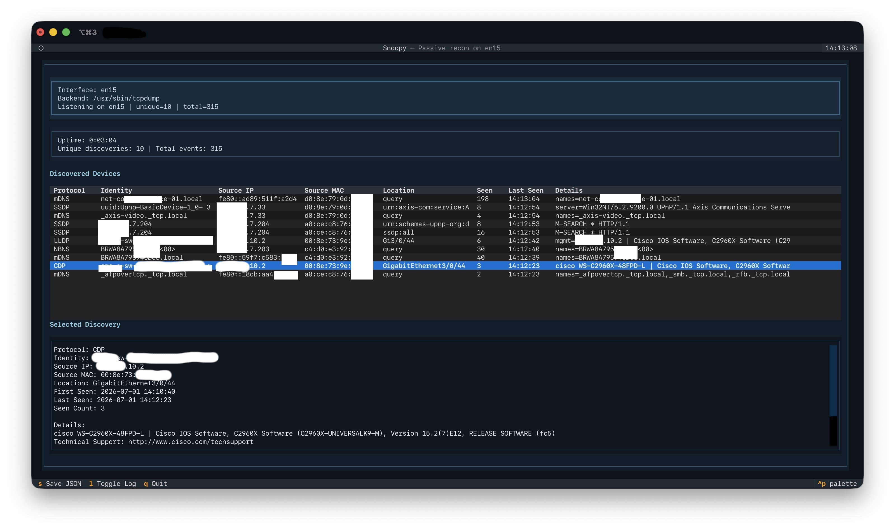

# Snoopy



`snoopy.py` is a passive local-network reconnaissance tool with a Textual TUI. It listens for common discovery and routing traffic already present on the LAN, turns that traffic into structured discovery events, and presents the results in a live dashboard.

It does not actively scan or probe hosts. Instead, it watches traffic such as LLDP, CDP, DHCP, mDNS, NBNS, SSDP, WS-Discovery, and OSPF/OSPFv3 to help you understand what devices and services are advertising themselves.

## History

`snoopy.py` is a reimagining of the `snoopy.pl` tool that I wrote back in the 1990s.

## What It Does

- Captures packets with `tcpdump`
- Decodes passive discovery traffic from multiple protocols
- De-duplicates discoveries into a live device table
- Shows details and recent-event logs in a Textual dashboard
- Lets you save the current discovery state as JSON with a single keypress

## Requirements

- macOS or Linux
- Python 3.13+
- [`uv`](https://github.com/astral-sh/uv)
- `tcpdump` available in `PATH`
- Permission to capture packets on the target interface

On many systems you will need elevated privileges to capture traffic, for example `sudo`.

## Project Dependency State

This repository is configured for `uv` and currently expects:

- Python: `3.13`
- Runtime dependency: `textual>=8.2.8`
- External system dependency: `tcpdump`

The authoritative Python project metadata lives in `pyproject.toml`. The script also carries an inline `uv` header so it can be run directly as an executable.

## Setup

Install the Python dependency into the local environment:

```bash
uv sync
```

If you prefer to use a specific interpreter:

```bash
uv python pin 3.13
uv sync
```

Make sure `tcpdump` is installed separately through your OS package manager or system tools.

## Usage

Run the app through `uv`:

```bash
uv run snoopy.py
```

Because packet capture often requires privileges, a common invocation is:

```bash
sudo uv run snoopy.py
```

You can also rely on the executable shebang if the file is marked executable and `uv` is installed:

```bash
./snoopy.py
```

### CLI Options

```text
-i, --interface   Capture on a specific interface
-c, --count       Stop after this many decoded discovery events
```

Examples:

```bash
uv run snoopy.py --interface en0
uv run snoopy.py --count 50
sudo uv run snoopy.py --interface eth0 --count 100
```

If you do not pass `--interface`, Snoopy tries to detect the default-route interface automatically on macOS or Linux.

## Dashboard Controls

- `q`: quit
- `l`: toggle the recent discoveries log pane
- `s`: save the current discoveries to `snoopy-discoveries-YYYYMMDD-HHMMSS.json`

The saved JSON file is written to the current working directory.

## Decoded Protocols

- LLDP
- CDP
- DHCP
- mDNS
- NBNS
- SSDP
- WS-Discovery
- OSPF
- OSPFv3

## Notes And Limitations

- Snoopy is passive. If the network is quiet, the dashboard will stay quiet.
- Discovery quality depends on what neighboring devices choose to advertise.
- DHCP `DHCPOFFER` traffic is often reply traffic directed at a specific client, so whether Snoopy can see it depends on your capture vantage point.
- `tcpdump` must be present and runnable by the current user.
- Interface auto-detection currently supports macOS and Linux only.

## Troubleshooting

If startup fails:

- Confirm `tcpdump` is installed and in `PATH`
- Retry with elevated privileges if packet capture permissions are missing
- Pass `--interface` explicitly if default-route detection chooses the wrong device
- Re-run `uv sync` if `textual` is missing locally

If you want a quick syntax sanity check without starting capture:

```bash
python3 -m py_compile snoopy.py
```
